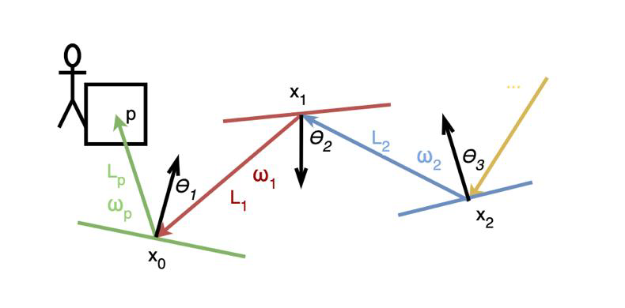
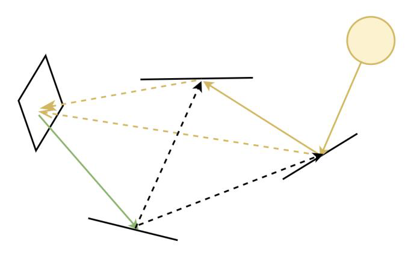
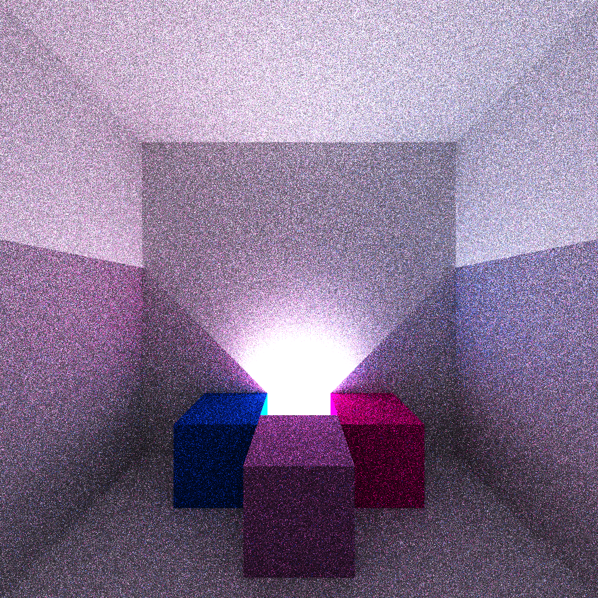
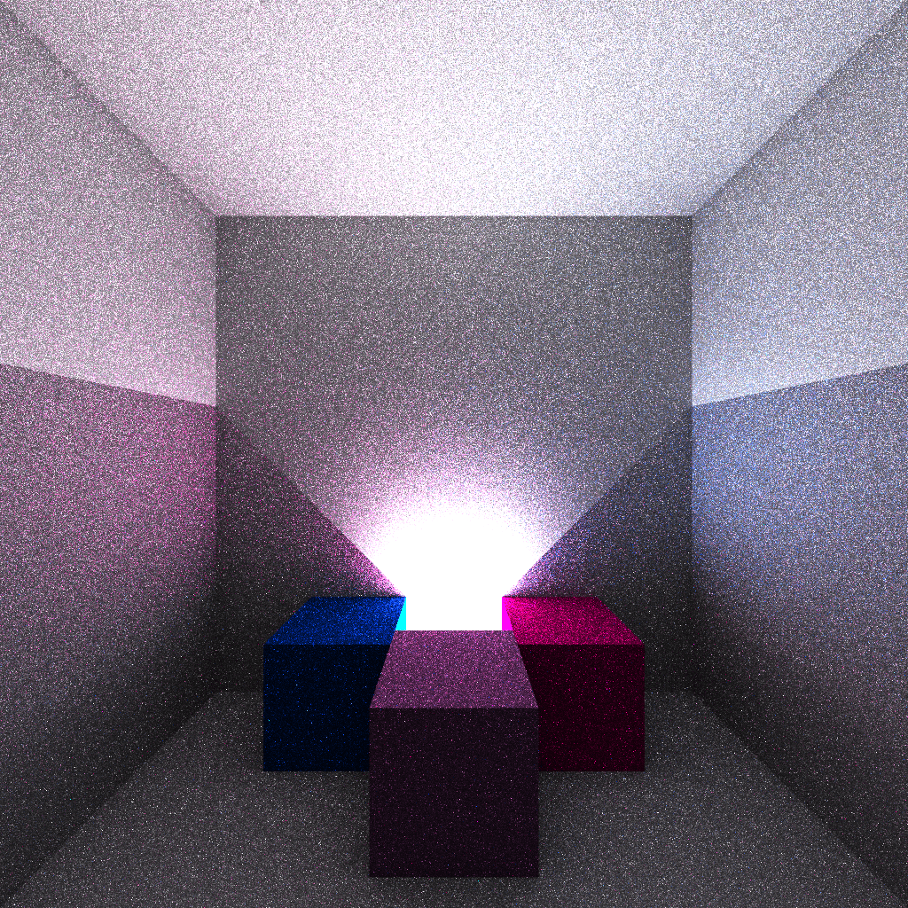

# C++/CUDA path tracer

## Features

### Bidirectional path tracing

Bidirectional path tracing starts a regular path from the camera and in addition chooses a random light source and starts a path from there as well. When these paths are constructed, it takes all possible ways to connect them and make multiple paths.

    

        
        

            <small><b>Simple path tracing visualization</b></small>
        

    

    

        
        

            <small><b>Bidirectional path tracing visualization</b></small>
        

    

The main advantage here is not the multiple paths, because we could do that by increasing the sample size, but the fact that light sources can "find their way" through smaller openings more easily. This leads to less noise because it increases the chances of the light source being found during the construction of a single path, smoothing the samples out instead of a few "lucky" samples finding the light with great weight, causing noise.

The picture on the left shows a simple path tracer with a maximum depth of 6. The picture on the right shows a path tracer with a maximum depth of 3 for both the camera and light paths. We can see that the parts of the scene that are lit by multiple reflections have less noise.

    

        
        

            <small><b>Simple path tracing with max depth 6</b></small>
        

    

    

        
        

            <small><b>Bidirectional path tracing with max depth 3 for camera and light paths</b></small>
        

    

### HDR Environment map

An environment map consists of 6 HDR images arranged in a cube formation. The scene is placed inside this infinitely large cube, which acts as a light source. The intensity of each pixel in the environment map determines the amount of light coming from that direction, creating omnidirectional lighting for the scene.

    
    

        <small><b>A scene inside an evironment map</b></small>
    

### K-d tree space partitioning for large mesh objects

A k-d tree sorts the triangles of a mesh object into a binary tree of bounding boxes. This helps with rendering speed because we first find the smallest bounding box that contains the intersection and then only calculate the intersections of the triangles included in that bounding box.
With this method, at each step we can roughly halve the number of triangles we are still considering as possible intersection points.

    
    

        <small><b>K-d tree visualization</b></small>
    

